# Tableau- Global School Dropout Rates
Our project for Data Visualisation created on Tableau, during our second year of engineering as part of our Data Science and Analytics Honours
It is a detailed case study on Global School Dropout rates. 
This repository contains the Tableau file, the preprocessed dataset used in this case study, and screenshots regarding the visualisation

## Table of Contents
- [Table of Contents](#table-of-contents)
- [Introduction](#introduction)
- [Dataset](#dataset)
- [Analysis and Visualisations](#analysis-and-visualisations)
- [Results](#results)
- [Contributors](#contributors)
- [Institute](#institute)

## Introduction

* School dropout rate, as the name suggests, is the percentage or rate of students failing to complete a particular schooL due to various reasons. 
* Our Dataset consists of students dropping out globally, in their upper secondary i.e. 9th-12th standards. 
* We have analyzed 106 countries which have been segragted in 3 groups based on their development:
   - Least Developed (41) 
   - Less developed  (57)
   - More Developed  (8)

## Dataset

* Our dataset has been taken from Kaggle
* It was curated by Komal Khetani and the data was sourced from various household surveys conducted by the UNICEF in various countries, in the past years. 
* Link: https://www.kaggle.com/komalkhetlani/out-of-school-rates-global-data?select=Upper+Secondary.csv

# Analysis and Visualisations

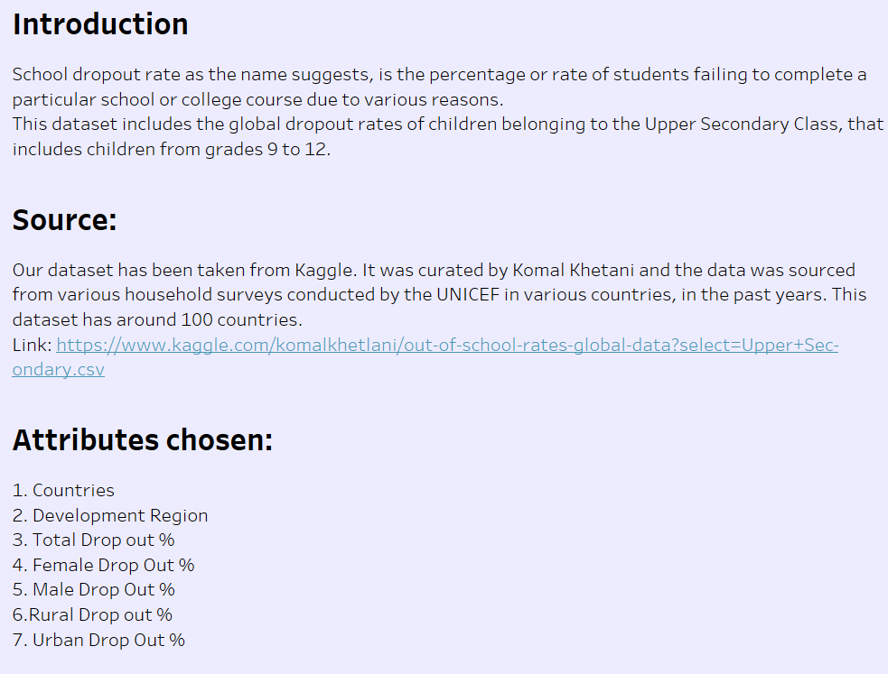
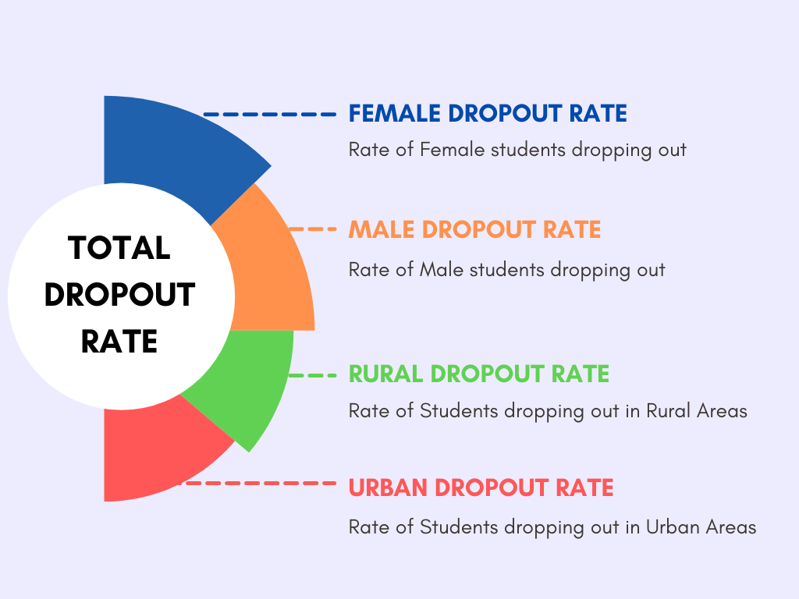
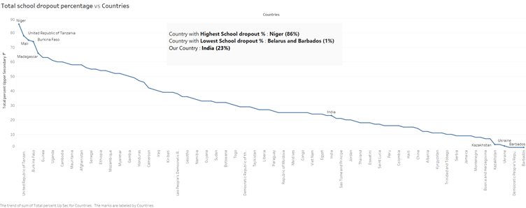
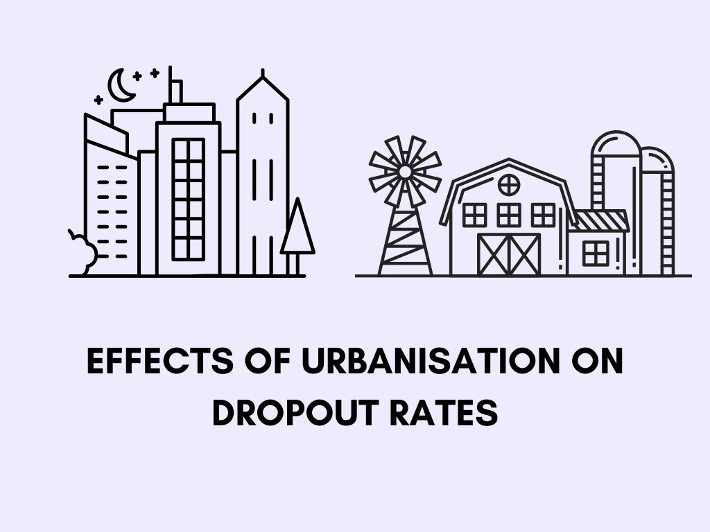
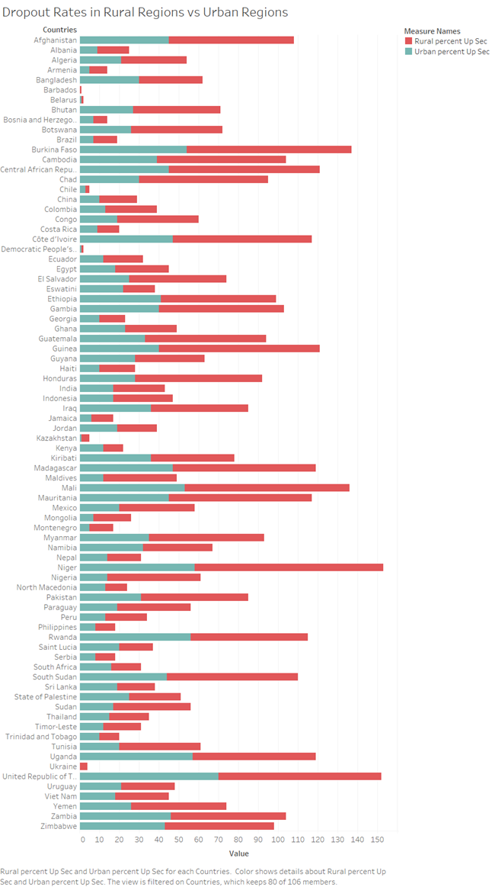
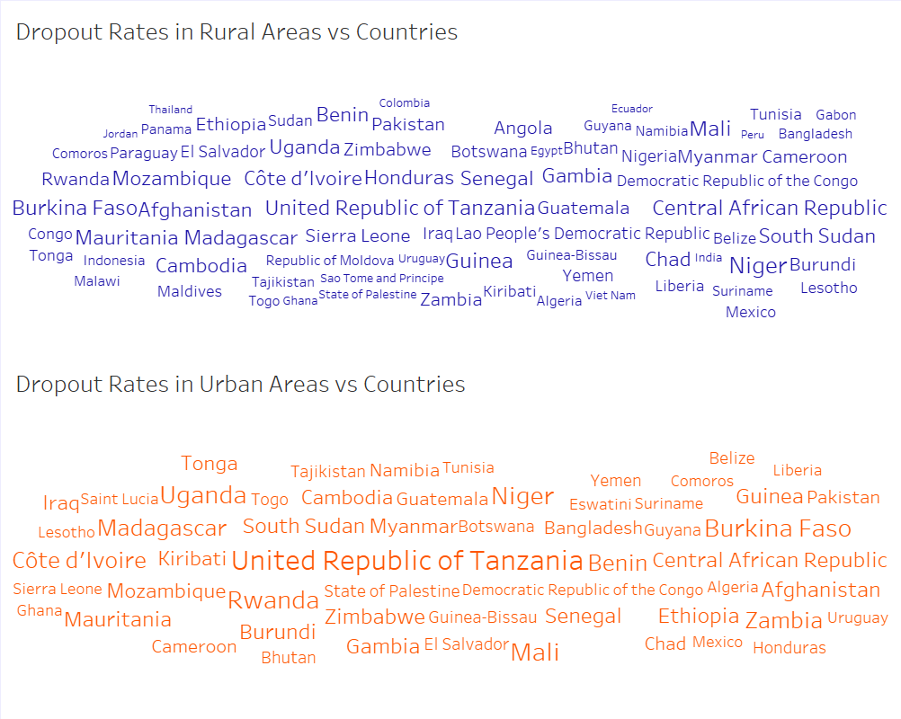
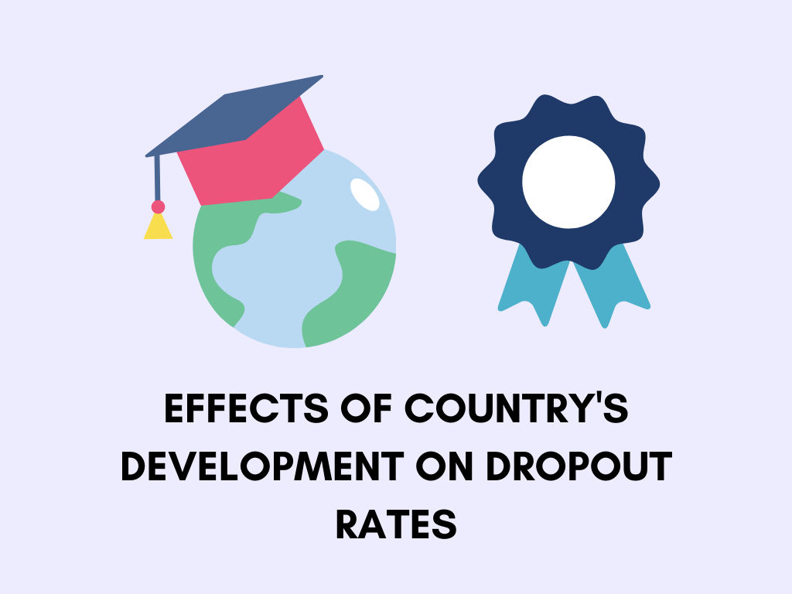
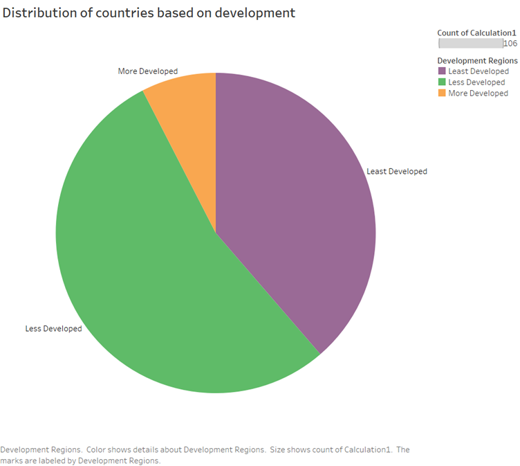
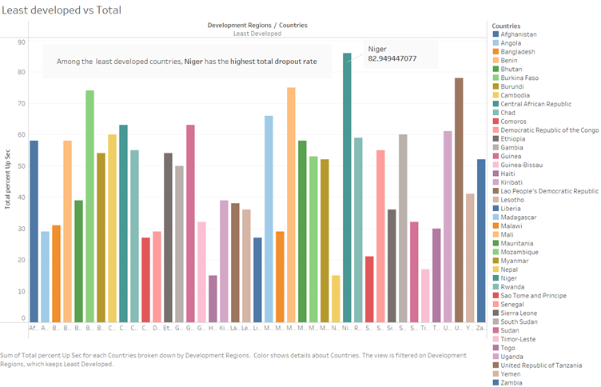
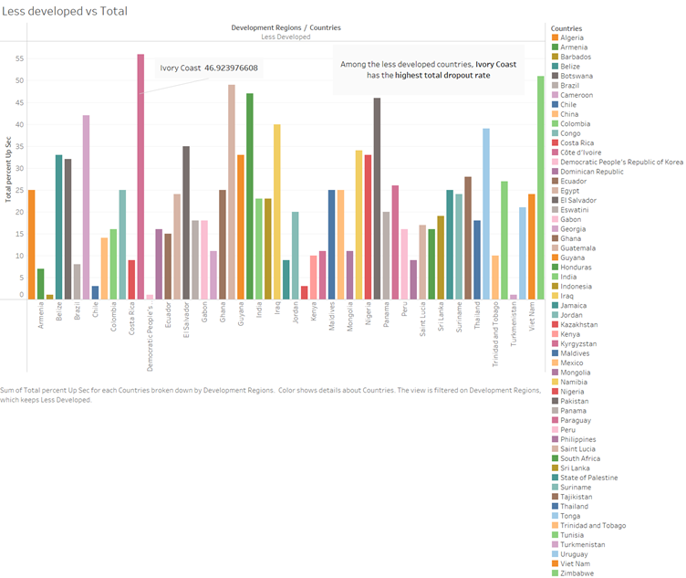
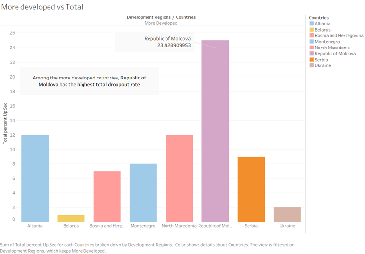

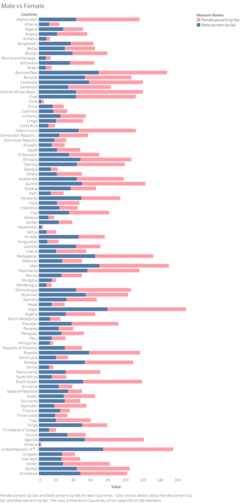
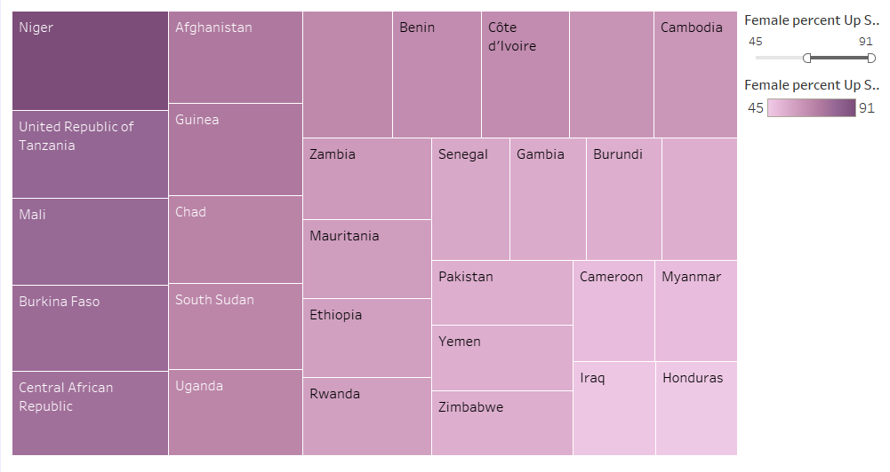
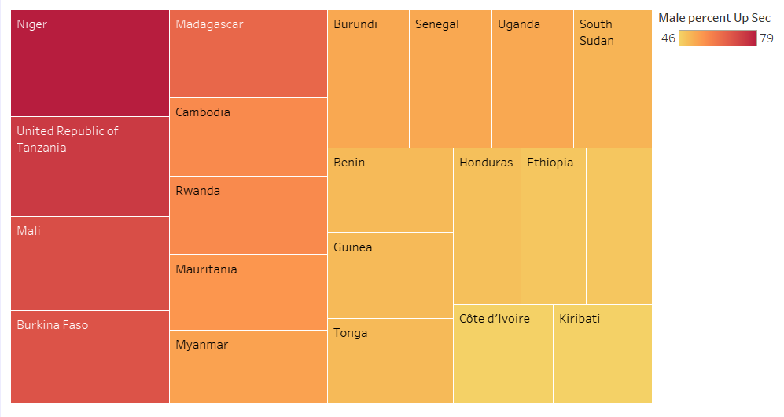
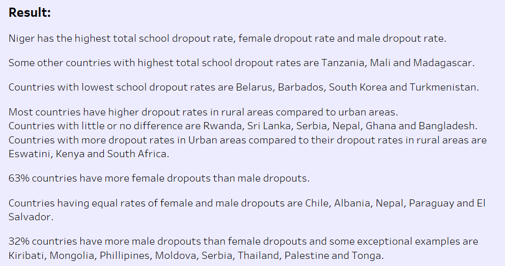
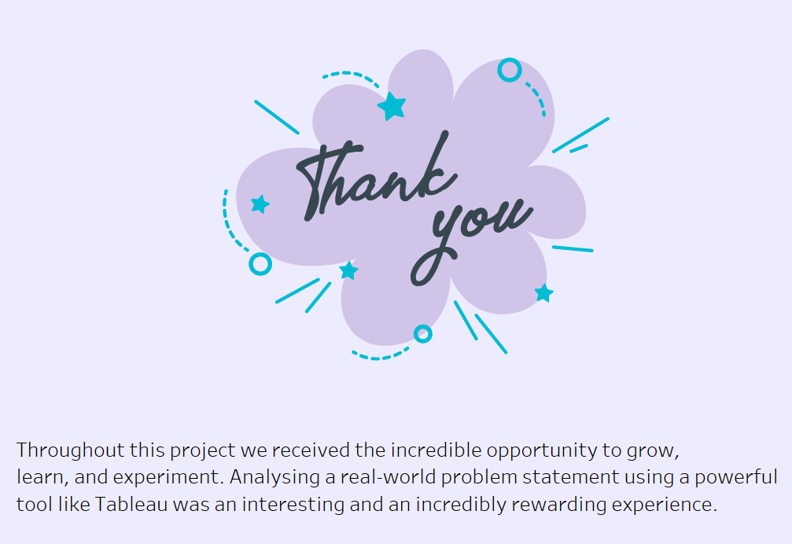

## Results
* Niger has the highest total school dropout rate, female dropout rate and male dropout rate.
* Most countries have higher dropout rates in rural areas compared to urban areas. Some Exceptions are Eswatini, Kenya and South Africa.
* 63% of countries have more female dropouts than male dropouts. Some exceptions are Kiribati, Mongolia, Philippines, Moldova, Serbia, Thailand, Palestine and Tonga.
* India has a relatively low drop our rate i.e. 23 %. Female Dropout rate is 5% more than Male Dropout rate and Dropout rate in Rural Areas is 9% more than the dropout rate in Urban Areas.

# Contributors
| Sr No. | Name               | E-mail                       | git-profile     | Roll No.        |
| -------| -------------------| -----------------------------| ----------------| ----------------|
| 1.     | Varshaah Karkala   | varshaah.k@somaiya.edu       | varshaah2407    | 16010120193     |
| 2.     | Shruti Tyagi       | shruti.tyagi@somaiya.edu     | shrutityagi4102 | 16010120202     |

# Institute

